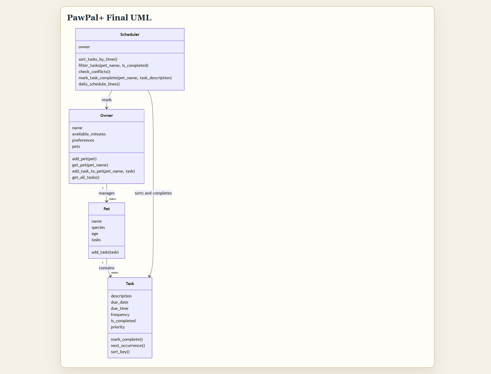
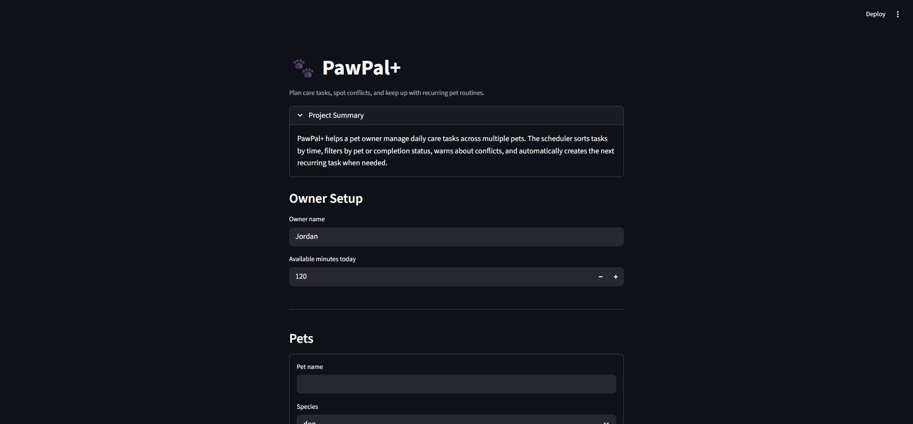

# PawPal+

PawPal+ is a Streamlit pet care planner that helps an owner organize daily routines across multiple pets. The project combines Python OOP, a scheduling layer, a CLI demo, automated tests, and a simple web UI.

## Features

- Manage an `Owner` with multiple `Pet` profiles
- Add pet care `Task` objects with dates, times, frequency, completion state, and priority
- Sort tasks chronologically through a dedicated `Scheduler`
- Filter tasks by pet and completion status
- Detect same-time task conflicts and surface warnings instead of crashing
- Automatically create the next occurrence of daily and weekly tasks when they are completed
- Use the same backend logic from both the CLI demo and the Streamlit app

## Run Locally

```bash
uv venv .venv --allow-existing
uv pip install --python .venv\Scripts\python.exe -r requirements.txt
uv pip install --python .venv\Scripts\python.exe ruff
.\.venv\Scripts\streamlit.exe run app.py
```

## CLI Demo

The project includes a CLI-first verification path in `main.py`.

```bash
.\.venv\Scripts\python.exe main.py
```

The script creates an owner, two pets, several tasks, prints a readable schedule, reports a conflict, and demonstrates recurring task generation after completion.

## Smarter Scheduling

PawPal+ includes four scheduling behaviors required by the project:

- `sort_tasks_by_time()` returns tasks in chronological order
- `filter_tasks()` narrows the schedule by pet and/or completion state
- `mark_task_complete()` marks the chosen task done and creates the next daily or weekly task when needed
- `check_conflicts()` finds duplicate date/time slots and returns warning messages

The conflict logic intentionally stays lightweight. It checks exact matching date/time slots rather than overlapping durations, which keeps the implementation readable and predictable for this project scope.

## Testing PawPal+

Run the automated suite with:

```bash
.\.venv\Scripts\python.exe -m pytest
```

The tests cover:

- task completion state changes
- task addition to a pet
- chronological sorting
- recurring task creation for daily tasks
- duplicate-time conflict warnings
- filtering behavior
- an empty-owner edge case

Confidence Level: 4/5 stars

The current test suite gives solid confidence in the main scheduling behaviors, but more cases could still be added for invalid time formats, weekly recurrence edge cases, and more advanced overlap detection.

## UML

The final class diagram is included in Mermaid source form and as a rendered image.



Files:

- `uml_final.mmd`
- `uml_final.html`
- `uml_final.png`

## Demo

Final Streamlit app screenshot:



## Project Structure

```text
app.py              Streamlit UI
pawpal_system.py    Core classes and scheduling logic
main.py             CLI demo script
tests/test_pawpal.py
reflection.md       Project reflection responses
uml_final.mmd       Mermaid UML source
uml_final.png       Rendered UML diagram
```
